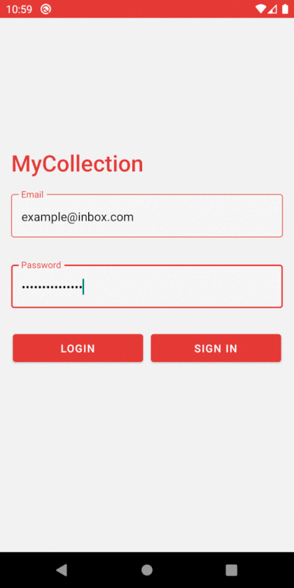

# MyCollection

### Description 
MyCollection is an android app, where user can browse movies/games/books. It is based on Firebase services.
By using Real Time Database app's data is rendered immediately after an update on server.

### Installation
Please follow the steps from <a href="https://rnfirebase.io/" title="RNFirebase">React Native Firebase</a>. 
Then the app is ready to go.

Icons made by <a href="https://www.flaticon.com/authors/good-ware" title="Good Ware">Good Ware</a> from <a href="https://www.flaticon.com/" title="Flaticon"> www.flaticon.com</a>

### Usage
User needs to be logged in before using our app. On the initial scene user can log in or create an account. 
Initial lists of movies/games/books are loaded from Firebase. User can add new titles providing theirs creators and also posters.
Before saving the item to database, user can check whether image URL is rendered properly, by clicking 'TEST' button on details scene.
Every list item has a checkbox, which indicates if that title was read/watched/played by user. Its status can be changed
by clicking that checkbox.

### Demo

